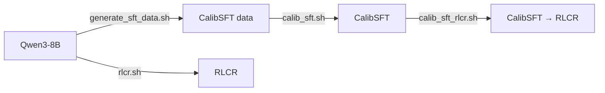

# Run



Each step has a script in `scripts/examples/train/` with the paper settings, and `scripts/examples/eval/` evaluates the resulting checkpoints on all 16 benchmarks.

## SFT Data Generation

Sample `K` responses per DeepScaleR question and build CalibSFT targets with mixing weight `TARGET_LAMBDA`:

```bash
DATASETS="DeepScaleR" \
MODEL_CONFIGS="Qwen3_8B" \
CONFIDENCE_FORMATS="probability" \
K=50 \
TARGET_LAMBDA=0.5 \
bash scripts/common/generate_sft_data.sh 0,1,2,3
```

Or download the released CalibSFT training data used in the paper:

```bash
hf download SUSTech/CalibSFT-DeepScaleR --repo-type dataset \
  --local-dir data/sft_data/base/deepscaler/qwen3_8b/probability/k50_lambda0.5
```

## SFT Training

```bash
DATASETS="DeepScaleRSFT" \
METHODS="CalibSFT" \
MODEL_CONFIGS="Qwen3_8B" \
CONFIDENCE_FORMATS="probability" \
SFT_DATA_DIRS="data/sft_data/base/deepscaler/qwen3_8b/probability/k50_lambda0.5" \
bash scripts/common/train.sh 0,1,2,3
```

## RL Training

From the base model (`METHODS` can be `RLVR`, `RLCR`, `CoCA`, or `DCPO`):

```bash
DATASETS="DeepScaleRRL" \
METHODS="RLCR" \
MODEL_CONFIGS="Qwen3_8B" \
CONFIDENCE_FORMATS="probability" \
bash scripts/common/train.sh 0,1,2,3
```

From CalibSFT (the released checkpoint, or a local one such as `logs/train/deep_scale_r/calib_sft/qwen3_8b/probability/<timestamp>/global_step_180/huggingface`):

```bash
DATASETS="DeepScaleRRL" \
METHODS="RLCR" \
MODEL_CONFIGS="Qwen3_8B" \
CONFIDENCE_FORMATS="probability" \
TRAIN_ARGS="--model-name-or-path SUSTech/Qwen3-8B-CalibSFT" \
bash scripts/common/train.sh 0,1,2,3
```

To skip questions that all 50 base-model responses solve, build the ID list from the rollout audit written by SFT data generation and add it to any RL command:

```bash
python data_processing/rl_filters/generate_all_correct_ids.py \
  --audit data/sft_data/base/deepscaler/qwen3_8b/probability/k50_lambda0.5/train_rollout_audit.jsonl \
  --output data/rl_filters/deep_scale_r/qwen3_8b_k50_all_correct.txt

DATASETS="DeepScaleRRL" \
METHODS="RLCR" \
MODEL_CONFIGS="Qwen3_8B" \
CONFIDENCE_FORMATS="probability" \
TRAIN_ARGS="--train-exclude-ids-file data/rl_filters/deep_scale_r/qwen3_8b_k50_all_correct.txt" \
bash scripts/common/train.sh 0,1,2,3
```

## Evaluation

Temperature 0.6, 4 responses per question and 32 on AIME:

```bash
MODEL_PATH="Qwen/Qwen3-8B"  # or a trained checkpoint

MODEL_PATHS="$MODEL_PATH" \
DATASETS="DeepScaleR_Eval Math500 MinervaMath OlympiadBench GSM8K \
HotpotVanilla TriviaQA DROP MuSiQue LiveBenchReasoning NQOpen PopQA WebQuestions" \
EVAL_ARGS="--temperature 0.6 --num-generations 4" \
bash scripts/common/eval.sh 0,1,2,3

MODEL_PATHS="$MODEL_PATH" \
DATASETS="AIME2024 AIME2025 AIME2026" \
EVAL_ARGS="--temperature 0.6 --num-generations 32" \
bash scripts/common/eval.sh 0,1,2,3
```
